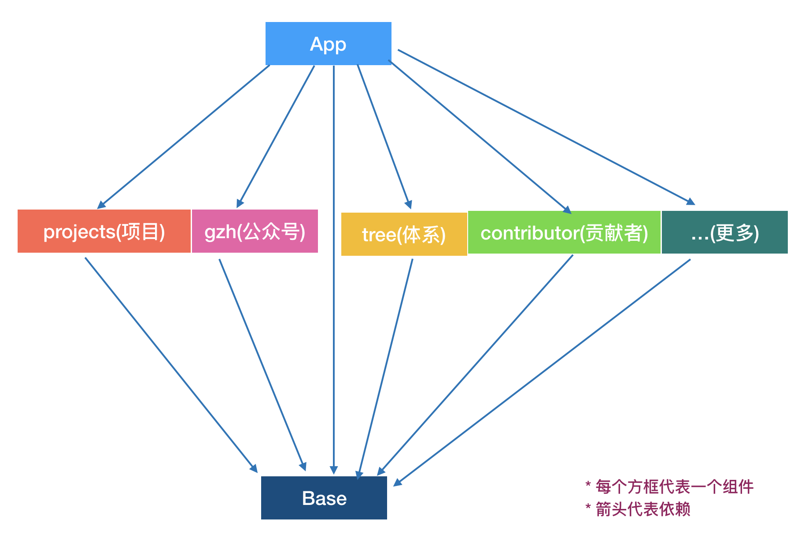
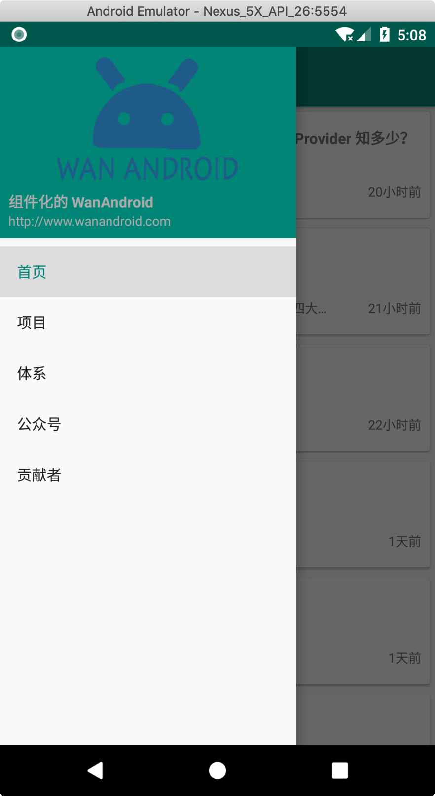
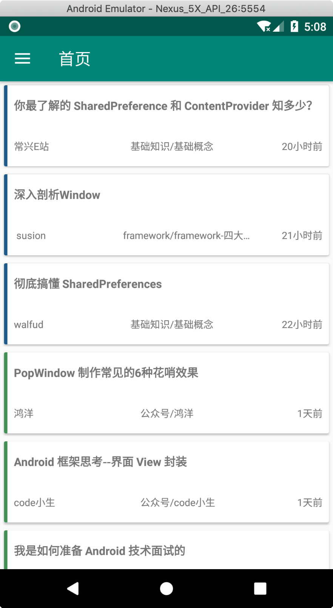
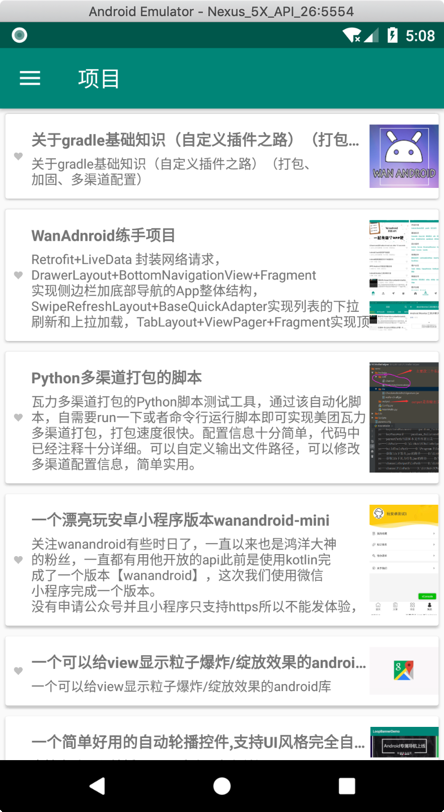
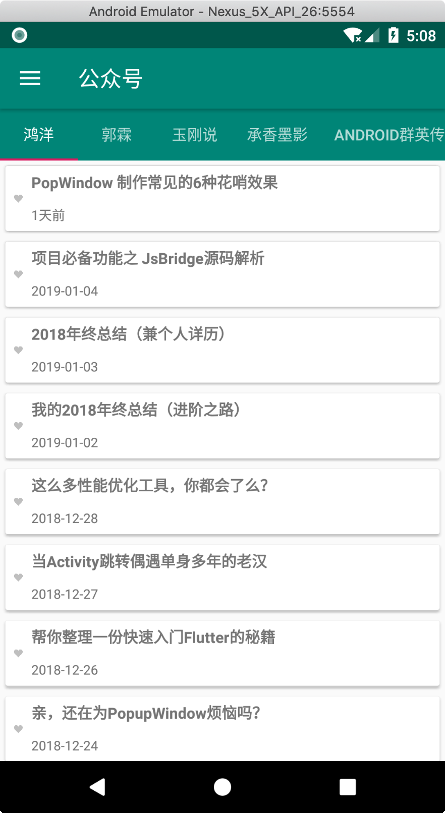
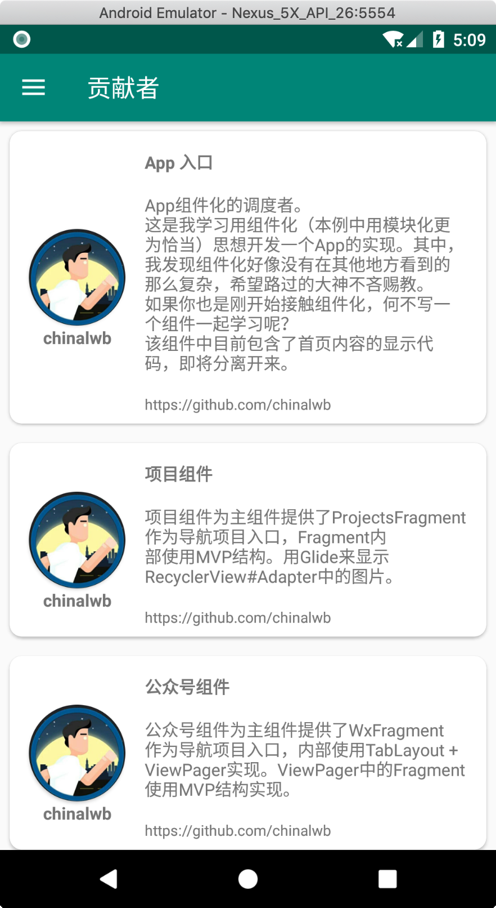
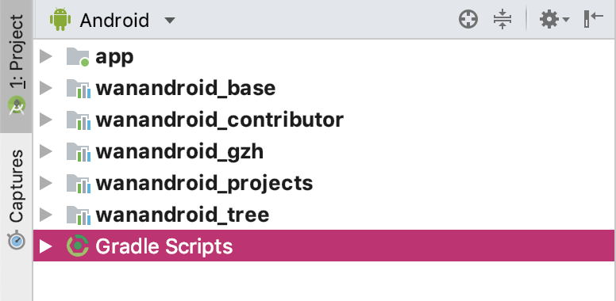
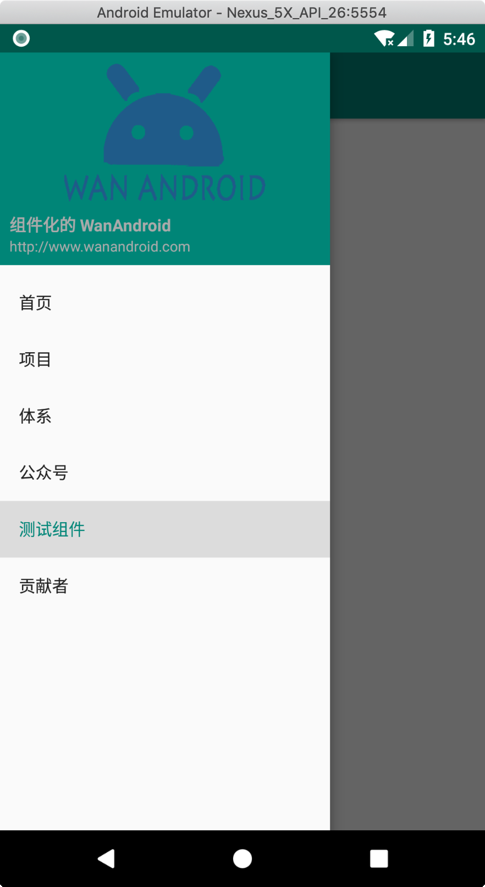
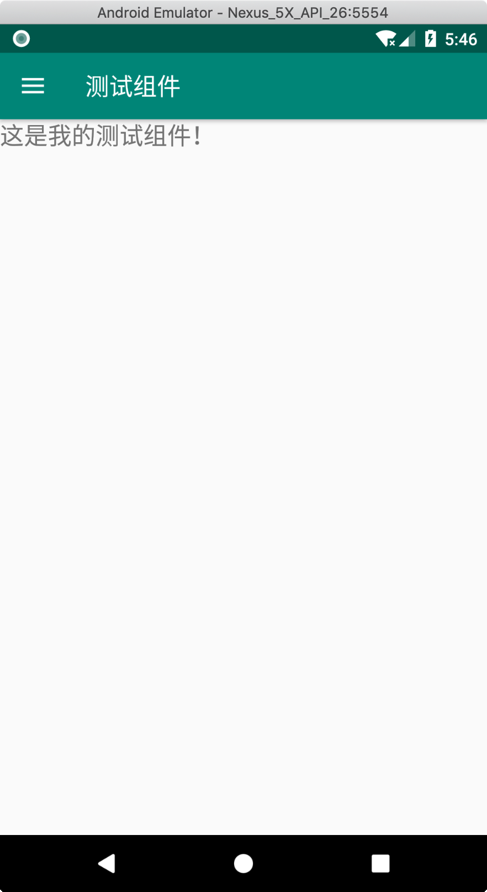
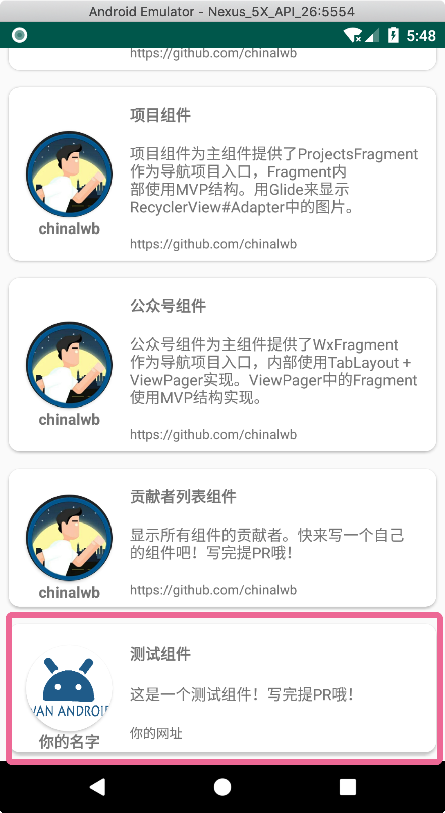

# 组件化的 wan_android App

* [前言](#前言)
* [组件化思想](#组件化思想)
* [实现方法](#实现方法)
* [自己亲手做一个组件?](#自己亲手做一个组件)


### 前言
* 依照 玩Android 惯例，感谢鸿洋大神提供的 玩Android API
* 我是一个小小小小小菜鸟，这个项目是我用来学习Android开发的
* 最近听说组件化开发很流行，我感觉很神秘，于是在读过很少的一些资料之后开始按照自己的理解来做组件化的实现
* 这个项目用“模块化”来表述更贴切
* 对于组件化这个话题来说，我希望能用最简单的语言和实现来描述清楚我的理解。
* 这个项目是从0x0000开始写的, 所以（我期望）像我一样的小白也能看的清清楚楚
* 按照[自己亲手做一个组件?](#自己亲手做一个组件)检出代码, 自己练习一下就更明白他有多简单了
* 这个项目中的东西极其简单，组件化的内容现在也是只是涵盖了我认为最主要的一部分，不过我会继续加强，引入更多有意思的东西
* 希望路过的大神不吝赐教
* 如果你也在学习组件化，不妨一起来做一个组件化实现 （我会在下面列出操作步骤），然后欢迎探讨、敬请不吝赐教

### 组件化思想
* 听起来很神秘，我现在很肤浅地理解为：把一个大的App进行拆分，每个功能或每个组件分别用一个 Android Library 或 Module 来实现。
* 我很肤浅的理解为：其中最重要的一点是：如何拆分 以及 如何整合
* 我很肤浅的在这个玩android app中做了一个简单的实现，大致如下：


运行截屏：











Android Studio截屏：


### 实现方法
1. 根据依赖关系的结构图，我把app分成了总分总的结构
2. App是入口组件，依赖所有导航页的组件
3. Base是基础组件，（不出意外的话）所有组件都依赖他
4. 根据上面 NavigationView 的运行截图，我把每个导航项目都单独分成了一个组件，比如我已经实现的组件有：`wanandroid_projects` / `wanandroid_gzh` / `wanandroid_contributor`
5. `wanandroid_base`中定义了一个 `BaseApplication`， 在这个类中有一个抽象方法 `public abstract void initServiceData();`, 所有导航页组件都继承此类并实现自己的 `initServiceData()` 方法，在这个方法内部提供导航控件所需要的信息
6. 拿 `wanandroid_projects` 来说：他的代码为(`NavigationViewItem` 和 `ContributorItem` 是在base组件中定义的model)：
```
public class ProjectApplication extends BaseApplication {

    @Override
    public void initServiceData() {
        List<NavigationViewItem> navigationItemList = ServiceProvider.getNavigationViewService().getNavigationViewItemList();
        NavigationViewItem navigationViewItem = new NavigationViewItem(
                1,
                R.id.nav_projects,
                2,
                "项目"
        );

        ProjectsFragment projectsFragment = ProjectsFragment.getInstance();
        IProjectsApi projectsApi = RetrofitClient.getRetrofit().create(IProjectsApi.class);
        new ProjectsPresenter(projectsApi, projectsFragment);
        navigationViewItem.setFragment(projectsFragment);

        navigationItemList.add(navigationViewItem);


        // 初始化 贡献者 数据
        ContributorService contributorService = ServiceProvider.getContributorService();
        List<ContributorItem> contributorItemList  = contributorService.getContributorItemList();
        ContributorItem contributorItem = new ContributorItem(
                "https://avatars0.githubusercontent.com/u/1758864?s=460&v=4",
                "chinalwb",
                "项目组件",
                "项目组件为主组件提供了ProjectsFragment作为导航项目入口，Fragment内部使用MVP结构。" +
                        "用Glide来显示RecyclerView#Adapter中的图片。",
                "https://github.com/chinalwb"
        );
        contributorItemList.add(contributorItem);
    }
}
```
7. `app`在运行的时候用反射读取所有导航页组件提供的信息并展示到页面上
8. 由于每个导航页组件在初始化`NavigationViewItem `的时候都提供了Fragment，所以App运行的时候可以知道点击导航项之后显示哪个fragment

### 自己亲手做一个组件 

在上述内容基础上，如何实现一个自己的玩Android组件？
1. checkout 这个项目
2. 在Android Studio中，右键 `app`, 选择 `New Module` > `Android Library` > Next 填入：`wanandroid_test` > Finish
![New Module] (./images/newModule.png)
![New Module] (./images/newModule2.png)
3. 编辑 `wanandroid_test`项目下的`build.gradle`, 添加如下的dependencies配置：
```
dependencies {
    implementation fileTree(dir: 'libs', include: ['*.jar'])

    implementation 'androidx.appcompat:appcompat:1.0.0-alpha1'
    testImplementation 'junit:junit:4.12'
    androidTestImplementation 'androidx.test:runner:1.1.0-alpha3'
    androidTestImplementation 'androidx.test.espresso:espresso-core:3.1.0-alpha3'

	 // 以下为添加内容：
    implementation project(':wanandroid_base')
    commonDependencies.each { key, value ->
        if (key.endsWith('Anno')) {
            annotationProcessor value
        } else if (key.endsWith('Impl')) {
            implementation value
        } else if (key.endsWith('Api')) {
            api value
        }
    }
}
```
这一步有两个作用：一个是依赖base组件，另一个是对这个library加上全局的依赖. Sync 一下。

4. 编辑 `app` 项目下的 `build.gradle`, 在dependencies部分加上对 `wanandroid_test` 的依赖
```
implementation project(':wanandroid_test')
```
Sync 一下。

5. 在 `wanandroid_base` 项目中 res > values > ids.xml 中增加 `<item name="nav_test" type="id"/>`
6. 在 `wanandroid_test` 项目中新建一个java类, 代码如下：

```
package com.chinalwb.wanandroid_test;

import com.chinalwb.wanandroid_base.BaseApplication;
import com.chinalwb.wanandroid_base.ServiceProvider;
import com.chinalwb.wanandroid_base.services.contributor.ContributorItem;
import com.chinalwb.wanandroid_base.services.contributor.ContributorService;
import com.chinalwb.wanandroid_base.services.navigation.NavigationViewItem;
import com.chinalwb.wanandroid_base.services.navigation.NavigationViewService;

import java.util.List;

public class TestApplication extends BaseApplication {
    @Override
    public void initServiceData() {
        // 初始化 导航 数据
        NavigationViewService navigationViewService = ServiceProvider.getNavigationViewService();
        List<NavigationViewItem> navigationViewItemList = navigationViewService.getNavigationViewItemList();

        NavigationViewItem navigationViewItem = new NavigationViewItem(
                1,
                R.id.nav_test,
                99,
                "测试组件"
        );
        TestFragment testFragment = TestFragment.newInstance();
        navigationViewItem.setFragment(testFragment);
        navigationViewItemList.add(navigationViewItem);

        // 初始化 贡献者 数据
        ContributorService contributorService = ServiceProvider.getContributorService();
        List<ContributorItem> contributorItemList = contributorService.getContributorItemList();
        ContributorItem contributorItem = new ContributorItem(
                "http://www.wanandroid.com/resources/image/pc/logo.png",
                "你的名字",
                "测试组件",
                "这是一个测试组件！写完提PR哦！",
                "你的网址"
        );
        contributorItemList.add(contributorItem);
    }
}

```

你会发现 TestFragment 提示错误，因为还没创建，我们马上创建一个。

7. 创建一个TestFragment，代码如下：

```
package com.chinalwb.wanandroid_test;

import android.os.Bundle;
import android.view.LayoutInflater;
import android.view.View;
import android.view.ViewGroup;

import androidx.annotation.NonNull;
import androidx.annotation.Nullable;
import androidx.fragment.app.Fragment;

public class TestFragment extends Fragment {

    public TestFragment() {

    }

    public static TestFragment newInstance() {
        return new TestFragment();
    }

    @Nullable
    @Override
    public View onCreateView(@NonNull LayoutInflater inflater, @Nullable ViewGroup container, @Nullable Bundle savedInstanceState) {
        View view = inflater.inflate(R.layout.test_fragment, container, false);
        return view;
    }
}

```

layout (你需要自己创建一个 layout 文件夹):

```
<?xml version="1.0" encoding="utf-8"?>
<LinearLayout xmlns:android="http://schemas.android.com/apk/res/android"
    android:orientation="vertical" android:layout_width="match_parent"
    android:layout_height="match_parent">

    <TextView
        android:layout_width="wrap_content"
        android:layout_height="wrap_content"

        android:text="这是我的测试组件！"
        android:textSize="20sp"
        />
</LinearLayout>
```

8. 把这个组件在 base 组件的 `AppConfig.java` 中注册一下，这样，app启动的时候就会加载他。

```
package com.chinalwb.wanandroid_base;

public class AppConfig {

    private static final String MODULE_PROJECT = "com.chinalwb.wanandroid_projects.ProjectApplication";
    private static final String MODULE_TREE = "com.chinalwb.wanandroid_tree.TreeApplication";
    private static final String MODULE_GZH = "com.chinalwb.wanandroid_gzh.GzhApplication";
    private static final String MODULE_CONTRIBUTOR = "com.chinalwb.wanandroid_contributor.ContributorApplication";
    private static final String MODULE_TEST = "com.chinalwb.wanandroid_test.TestApplication";

    public static String[] MODULES = {
            MODULE_PROJECT,
            MODULE_TREE,
            MODULE_GZH,
            MODULE_CONTRIBUTOR,
            MODULE_TEST
    };

}
```

9. 运行!


导航页加了一项:


点击显示TestFragment:


贡献者列表中也加上了你的名字:



10. 我知道其中有很多可以改进的地方，请您指出来吧！


